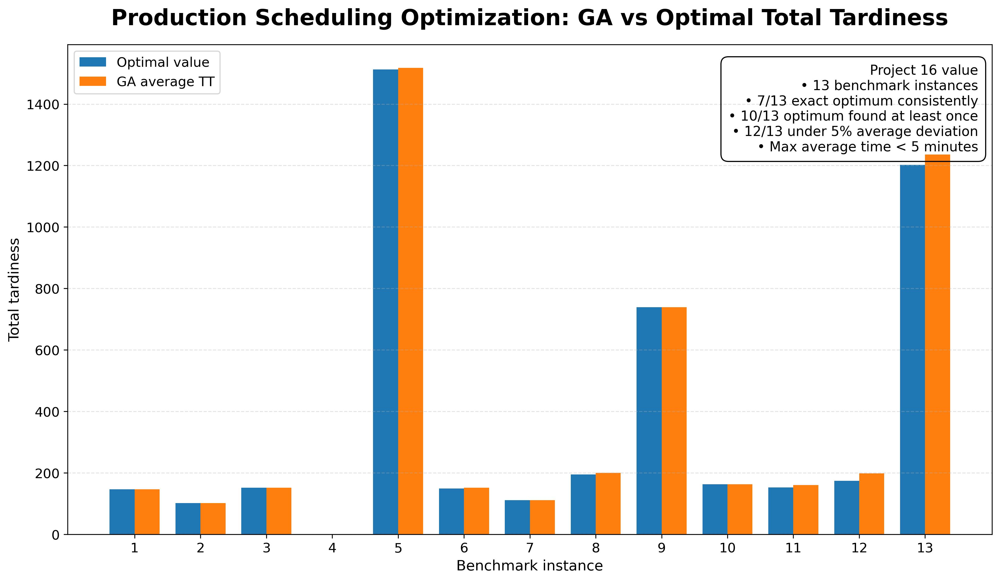
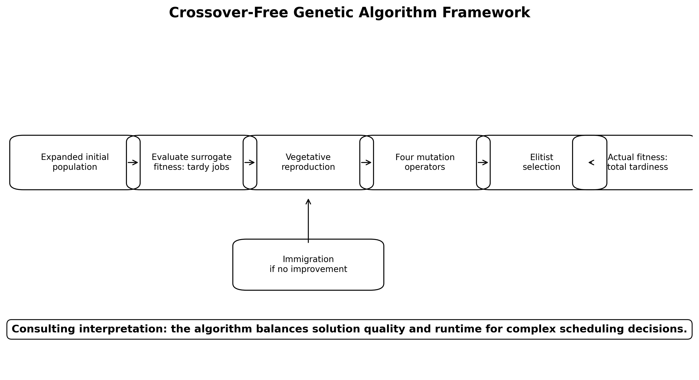
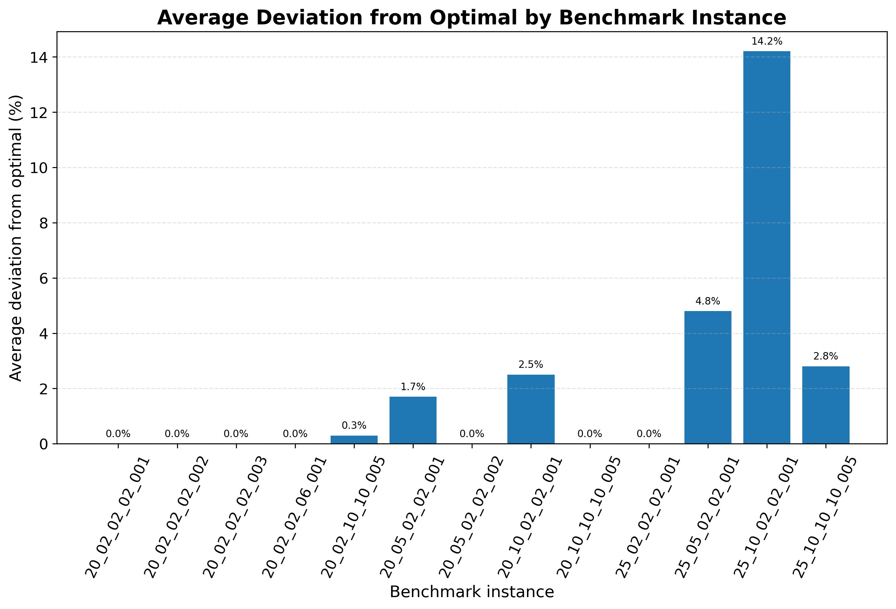
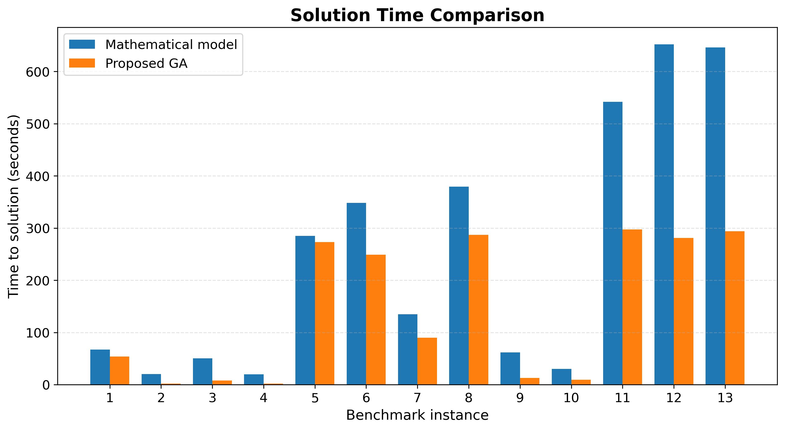

# Production Scheduling Optimization: Genetic Algorithm for Total Tardiness Reduction

## Project overview

This repository presents a production scheduling optimization case study based on the published paper:

**Ramadan, S. Z., Almasarwah, N., Abdelall, E. S., Suer, G. A., & Albashabsheh, N. T. (2023). An Accurate and Robust Genetic Algorithm to Minimize the Total Tardiness in Parallel Machine Scheduling Problems. Management and Production Engineering Review, 14(4), 28–40. https://doi.org/10.24425/mper.2023.147201**

The project focuses on minimizing **total tardiness** in identical parallel machine scheduling problems using a robust crossover-free Genetic Algorithm.



## Business problem

In production systems, jobs must be assigned and sequenced across parallel machines. Poor scheduling can increase lateness, customer dissatisfaction, overtime, production disruption, and operational cost.

The business question addressed in this project is:

> Can a robust Genetic Algorithm generate high-quality schedules for identical parallel machines while minimizing total tardiness within practical computational time?

## Proposed solution

The proposed algorithm is a **crossover-free Genetic Algorithm** based on vegetative reproduction. Instead of crossover, the method uses four mutation strategies:

1. Two Genes Exchange Mutation
2. Number of Jobs Mutation
3. Flip Ends Mutation
4. Flip Middle Mutation

The algorithm also uses three improvement strategies:

- Expanded initial population
- Surrogate fitness function
- Immigration operator



## Scheduling objective

The main objective is to minimize total tardiness:

```text
Total Tardiness = sum of lateness values for jobs completed after their due dates
```

## Experimental setup

The paper evaluates the proposed GA on 13 benchmark instances from Tanaka and Araki.

| Metric | Value |
|---|---:|
| Benchmark instances | 13 |
| Runs per instance | 100 |
| Job sizes | 20 and 25 jobs |
| Machine sizes | 2, 5, and 10 machines |
| Consistently reached optimum | 7 out of 13 instances |
| Found optimum at least once | 10 out of 13 instances |
| Average deviation under 5% | 12 out of 13 instances |
| Maximum average runtime | Less than 5 minutes |

## Key results

The proposed GA achieved strong accuracy and robustness:

- In 7 out of 13 benchmark instances, the GA consistently found the exact optimal value.
- In 10 out of 13 instances, the GA found the optimal total tardiness at least once.
- In 12 out of 13 instances, the average deviation from the optimal value was less than 5%.
- The worst average deviation was 14.2% for the 25-job, 10-machine problem.
- The maximum average time to the best solution was less than 5 minutes.



## Mathematical model vs GA

The paper compares the proposed GA with a mathematical model. The GA provides near-optimal or optimal results in shorter practical time for many benchmark instances.



## Consulting value

This project is relevant to:

- Production scheduling
- Manufacturing planning
- Operations research
- Factory performance improvement
- Customer due-date reliability
- Advanced analytics for manufacturing
- Metaheuristic optimization
- Decision-support system design

## Repository contents

```text
production_scheduling_optimization_ga/
│
├── README.md
├── CITATION.cff
├── requirements.txt
│
├── docs/
│   ├── executive_summary.md
│   ├── methodology.md
│   ├── business_impact.md
│   └── limitations_and_future_work.md
│
├── figures/
│   ├── project16_production_scheduling_optimization_summary.jpg
│   ├── 01_ga_framework.jpg
│   ├── 02_average_deviation_from_optimal.jpg
│   ├── 03_solution_time_comparison.jpg
│   ├── 04_optimal_found_frequency.jpg
│   ├── 05_machines_vs_deviation.jpg
│   └── 06_strategy_effectiveness_tests.jpg
│
├── data/
│   ├── benchmark_instances.csv
│   ├── ga_results_summary.csv
│   ├── mathematical_model_vs_ga_time.csv
│   ├── ga_strategy_hypothesis_tests.csv
│   ├── mutation_strategies.csv
│   └── project_key_metrics.csv
│
└── notebooks/
    └── production_scheduling_ga_demo.ipynb
```

## Disclaimer

This repository is prepared for educational, research, and portfolio demonstration purposes. The included data files are structured summary files based on values reported in the paper.
